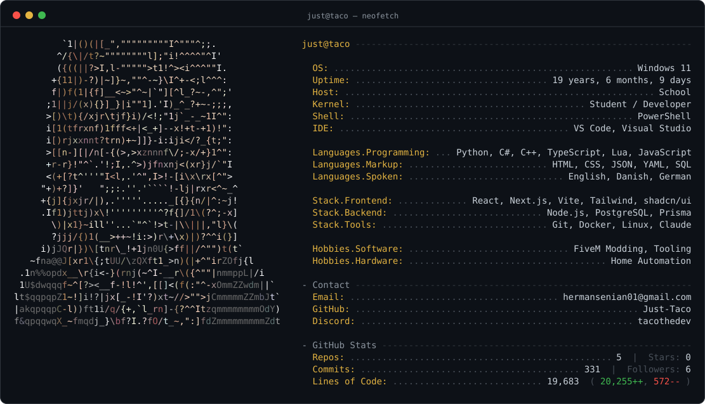
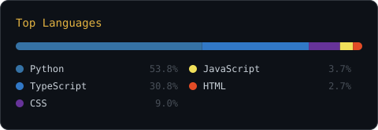

<h1 align="center">Hey, I'm Taco 🌮</h1>

  <picture>
    <source media="(prefers-color-scheme: dark)" srcset="assets/neofetch-dark.svg">
    <source media="(prefers-color-scheme: light)" srcset="assets/neofetch-light.svg">
    
  </picture>

  
  
  

---

### 🔧 Currently

- 🛠️ Building — FiveM resources, internal tooling and home automation
- 💬 Ask me about — TypeScript, C#, Lua, FiveM modding, self-hosting

  <picture>
    <source media="(prefers-color-scheme: dark)" srcset="assets/languages-dark.svg">
    <source media="(prefers-color-scheme: light)" srcset="assets/languages-light.svg">
    
  </picture>

The card above is generated by [`generate_neofetch.py`](generate_neofetch.py) and refreshed daily by
[a workflow](.github/workflows/update-profile.yml) — the uptime and the stats keep themselves current.

